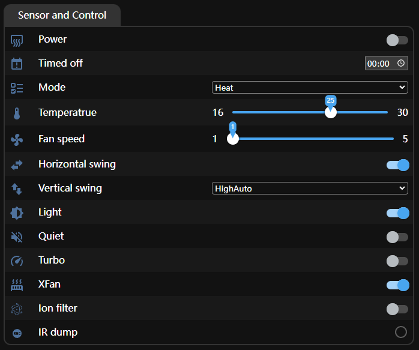

 基于ORVIBO CT30W的红外遥控器

## 功能特性

本项目基于ORVIBO CT30W，通过修改固件的方式刷入ESPHome，实现支持格力(Gree)`Kelvinator`协议的红外遥控器，支持如下功能：

- 作为红外遥控空调
    - 开关空调
    - 定时关机
    - 模式选择（自动、制冷、干燥、通风、制热）
    - 温度调整（16℃~25℃）
    - 风速调整（1~5）
    - 水平扫风
    - 垂直扫风（固定位置以及自动扫动）
    - 静音模式
    - 强力模式
    - 灯光开关
    - 离子过滤
    - XFan模式
- 配置断电保存
- 支持红外接收
- 具有系统状态指示灯
- 提供Web UI与接入Home Assistant以及其他ESPHome所支持的功能

其中红外接收功能主要是用来实现学码功能，使用此功能首先需要打开Web UI，然后**按住**设备边缘的按键，用其他的红外遥控器对准设备按下想要学码的按键，这样就可以在Web UI的日志中看到接收到的数据，之后如何将获取到的红外数据应用到设备中请参考[这个文档](https://github.com/crankyoldgit/IRremoteESP8266/wiki/Adding-support-for-a-new-AC-protocol#a-note-on-collecting-data)自行尝试。

另外对于系统状态指示灯关联了所有ESPHome组件，可以指示设备的状态，灯光的含义如下：

- 当警告处于活动状态时，缓慢闪烁（大约每秒一次）；
- 当出现错误时，快速闪烁（每秒多次）；
- 其他情况保持关闭。

## Web UI



在设备成功启动并接入WiFi后，在浏览器中打开`http://<IP Address>`即可访问Web UI，在上图的`Sensor and Control`面板中即可实现对空调的红外遥控。

## 如何使用

1. 参照[官方文档](https://esphome.io/guides/installing_esphome)完成ESPHome的安装；
2. 将此仓库拉取到本地：

```
git clone https://github.com/CCBP/ORVIBO-CT30W-ESPHome.git
```

3. 打开配置文件`ir-controller.yaml`，根据实际情况修改下方配置：

```
# Enable Home Assistant API
api:
  encryption:
    key: <your key>

ota:
  - platform: esphome
    password: <your password>

wifi:
  ssid: <your SSID>
  password: <your WiFi password>

  # Enable fallback hotspot (captive portal) in case wifi connection fails
  ap:
    ssid: "Ir-Controller Fallback Hotspot"
    password: <your AP password>
```

其中`api.encryption.key`的配置可以使用[官方文档](https://esphome.io/components/api.html#configuration-variables)中所给出随机生成的密钥；`ota.password`与`wifi.ap.password`可以任意配置一个自己喜欢的密码；`wifi.ssid`与`wifi.password`根据实际情况填写即可。

4. 生成工程并尝试编译

```
esphome compile ir-controller.yaml
```

:warning: **注意**：这次编译由于缺少头文件将会**报错**属于正常情况。

5. 添加头文件

为了实现红外收发功能，需要包含`IRremoteESP8266`库中的一些头文件`IRremoteESP8266.h`、`ir_Kelvinator.h`、`IRsend.h`、`IRrecv.h`和`IRac.h`，为此修改`ir-controller.yaml`如下（头文件所在路径可能需要根据实际情况修改）：

```
esphome:
  name: ir-controller
  libraries:
    - IRremoteESP8266
  includes:
    - .esphome/build/ir-controller/.piolibdeps/ir-controller/IRremoteESP8266/src/IRremoteESP8266.h
    - .esphome/build/ir-controller/.piolibdeps/ir-controller/IRremoteESP8266/src/ir_Kelvinator.h
    - .esphome/build/ir-controller/.piolibdeps/ir-controller/IRremoteESP8266/src/IRsend.h
    - .esphome/build/ir-controller/.piolibdeps/ir-controller/IRremoteESP8266/src/IRrecv.h
    - .esphome/build/ir-controller/.piolibdeps/ir-controller/IRremoteESP8266/src/IRac.h
```

由于ESPHome在生成cpp代码时会将`includes`组件放在`globals`组件之后，这导致声明在`globals`中`IRremoteESP5266`的自定义变量将会缺失，因此需要手动修改`.esphome/build/ir-controller/src/main.cpp`，补充头文件在`main.cpp`的**最开始**（注意要**放在自动生成代码之外**）。

```
#include "ir_Kelvinator.h"
#include "IRrecv.h"
// Auto generated code by esphome
// ========== AUTO GENERATED INCLUDE BLOCK BEGIN ===========
```

:question: 对于头文件的操作极为别扭，但我一番搜索下来并未发现优雅的解决办法，如果谁有更好的解决方案还望指教~

6. 连接USB转TTL串口模块

将USB转TTL串口模块**选择为3.3V模式**，并按照如下关系进行连接（使用杜邦线即可，可能需要焊接操作）：

| USB转TTL串口模块 | ORVIBO CT30W |
|------------------|--------------|
|TXD               |RX            |
|RXD               |TX            |
|GND               |GND           |

之后将USB转TTL串口模块连接到PC上即可（如果需要安装驱动请自行搜索学习）。

7. 编译并开始上传：

```
esphome run ir-controller.yaml
```

**注意**：在编译完成后选择通过串口上传到设备中前，需**将`GPIO0`在拉低情况下上电以进入刷机模式**。

8. 访问WebUI

待完成编译并上传到设备中后，根据提示将`RST`引脚拉低完成复位动作即可开始运行我们编写的程序，随后稍待片刻便可看到日志输出。

在日志中找到`wifi`组件的如下输出：

```
[14:26:55][C][wifi:600]: WiFi:
[14:26:55][C][wifi:428]:   Local MAC: <local MAC address>
[14:26:55][C][wifi:433]:   SSID: <SSID>
[14:26:55][C][wifi:436]:   IP Address: 192.168.1.125
[14:26:55][C][wifi:439]:   BSSID: <AP MAC address>
[14:26:55][C][wifi:441]:   Hostname: 'ir-controller'
[14:26:55][C][wifi:443]:   Signal strength: -49 dB ▂▄▆█
[14:26:55][C][wifi:447]:   Channel: 1
[14:26:55][C][wifi:448]:   Subnet: 255.255.255.0
[14:26:55][C][wifi:449]:   Gateway: 192.168.1.1
[14:26:55][C][wifi:450]:   DNS1: 192.168.1.1
[14:26:55][C][wifi:451]:   DNS2: 0.0.0.0
```

其中`IP Address`便是设备的IP地址，之后便可访问`http://<IP Address>`访问Web UI以控制设备。

## 自定义

本项目基于ORVIBO CT30W开发，因此所用引脚均根据CT30W中的硬件连接所定，但理论上只要是ESP8266都可以使用此项目。并且由于我家中的设备是格力的空调设备，所以本项目仅适配了其对应的`Kelvinator`协议，但理论上`IRremoteESP8266`库中列出[支持的IR协议](https://github.com/crankyoldgit/IRremoteESP8266/blob/master/SupportedProtocols.md)都是可以修改此项目进行适配的，但是因为IR协议众多并且我也没有对应的设备测试，所以这里不再进行描述，如果有问题欢迎提issue与我交流。

### 引脚修改

本项目所使用的4个引脚的功能机修改位置如下：

- `GPIO14`：输出，用于控制红外发射二极管，即实现红外遥控的功能，修改`globals`组件`id`为`ir_send_pin`的`initial_value`的值即可；
- `GPIO5`：输入，用于读取红外接收二极管的电平，实现学码的功能，修改`globals`组件`id`为`ir_recv_pin`的`initial_value`的值即可；
- `GPIO4`：输入，用于读取按键电平，仅当按键按下时才开启红外接收功能，修改`binary_sensor`组件`pin`中的`number`的值即可；
- `GPIO15`：输出，用于控制LED状态，指示当前系统状态，修改`status_led`组件的`pin`的值即可。

# 参考

- https://github.com/crankyoldgit/IRremoteESP8266
- https://esphome.io/guides/getting_started_command_line
- https://www.bilibili.com/opus/967982171394408465?jump_opus=1
- https://github.com/web1n/ORVIBO-CT30W
